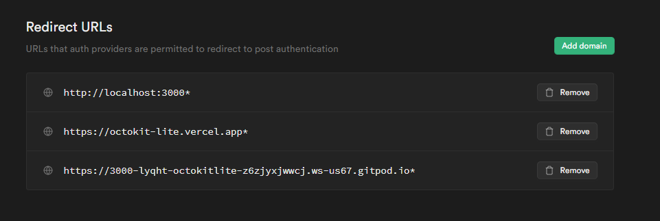

Table of contents
- [Contributing to Octokit-lite](#contributing-to-octokit-lite)
  - [Any contributions you make will be under the MIT Software License](#any-contributions-you-make-will-be-under-the-mit-software-license)
  - [Report bugs using Github's issues](#report-bugs-using-githubs-issues)
  - [Write bug reports with detail, background, and sample code](#write-bug-reports-with-detail-background-and-sample-code)
  - [Setting up the project](#setting-up-the-project)
    - [Supabase](#supabase)
  - [References](#references)


# Contributing to Octokit-lite
We love your input! We want to make contributing to this project as easy and transparent as possible, whether it's:

- Reporting a bug
- Discussing the current state of the code
- Submitting a fix
- Proposing new features/designs

## Any contributions you make will be under the MIT Software License
In short, when you submit code changes, your submissions are understood to be under the same [MIT License](http://choosealicense.com/licenses/mit/) that covers the project. By contributing, you agree that your contributions will be licensed under its MIT License.

## Report bugs using Github's [issues](https://github.com/briandk/transcriptase-atom/issues)
We use GitHub issues to track public bugs. Report a bug by opening a new issue; it's that easy!

## Write bug reports with detail, background, and sample code

**Great Bug Reports** tend to have:

- A quick summary and/or background
- Steps to reproduce
  - Be specific!
  - Give sample code if you can. [My stackoverflow question](http://stackoverflow.com/q/12488905/180626) includes sample code that *anyone* with a base R setup can run to reproduce what I was seeing
- What you expected would happen
- What actually happens
- Notes (possibly including why you think this might be happening, or stuff you tried that didn't work)

## Setting up the project

### Supabase

Please refer to `.env.template` for the env variables you may need. I am not going to give you the prod Supabase project access, so please create your own Supabase project and populate those values. 

For tables, you need to create these table(s).

```
create table "DeletedRecords" (
  id bigint not null primary key,
  created_at timestamp default now(),
  repo text not null,
  "sourceRepo" text,
  "isFork" boolean not null,
  "userId" uuid,
  "repoDetails" json not null
);


create table "UpdatedRecords" (
  id bigint not null primary key,
  created_at timestamp default now(),
  repo text not null,
  "userId" uuid,
  "initialRepoDetails" json not null,
  "updatedFields" json not null
);

```

> Thanks Zernonia! This create table script is generated using [supabase-schema](https://github.com/zernonia/supabase-schema).

Then you need to add additional auth URLs to your project, depending on the URL you spin up the app on.

- If you are working **locally**, it should be `http://localhost:3000`
- If you are working on **Gitpod**, it should be `**.gitpod.io`

This is my Supabase project auth URL configuration that allows for connecting to localhost, gitpod and prod. You can follow this.



To authenticate to Github, please turn on the Github authentication method in Supabase. To fill the values, please create a GitHub app on your own and fill those values in.

Example


## References
Some of the contributing guidelines are ripped from [this template](https://gist.github.com/briandk/3d2e8b3ec8daf5a27a62).
