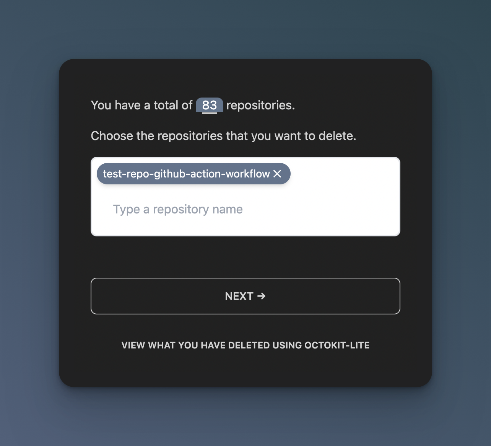
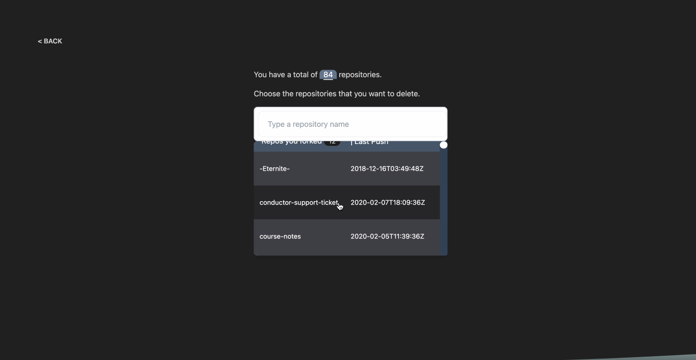
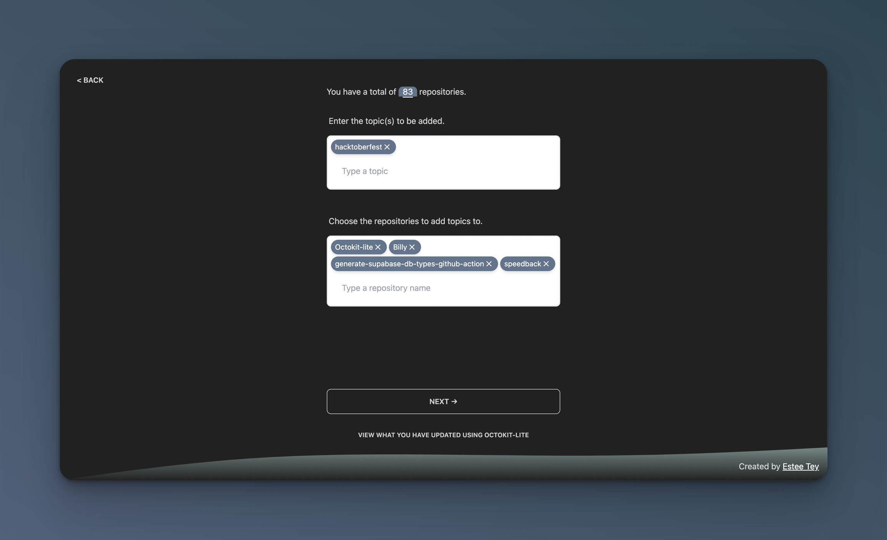
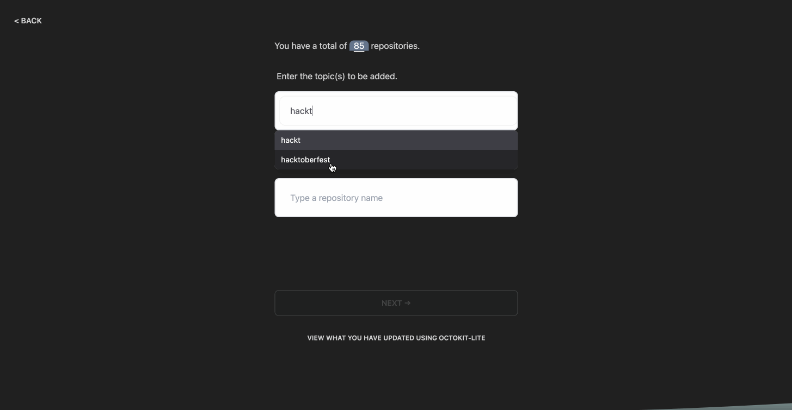
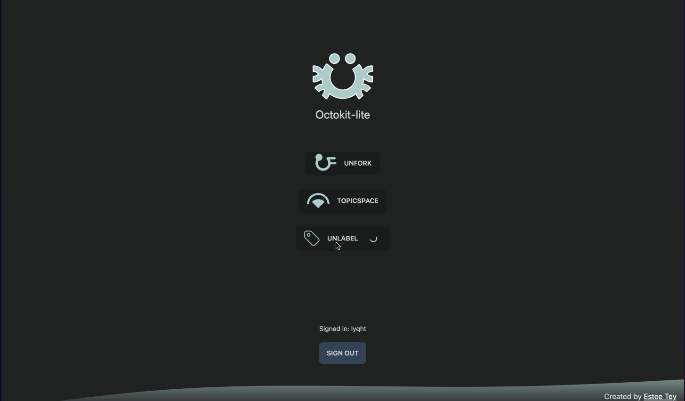

    
    <h1>Octokit-lite </h1>
    
Performs GitHub operations on multiple repositories <i>efficiently</i>

     
  </a>

At the moment, Octokit lite has the following functionalities:
- [Unfork](#unfork)  — Delete repos.
- [TopicSpace](#topicspace)  — Add topic(s) to repos.
- [Unlabel](#unlabel)  — Remove issue label(s) from repos.
---

**Table of contents**

- [Unfork](#unfork)
  - [Features](#features)
  - [Demo](#demo)
- [TopicSpace](#topicspace)
  - [Features](#features-1)
  - [Demo](#demo-1)
- [Unlabel](#unlabel)
  - [Features](#features-2)
  - [Demo](#demo-2)
- [Tech Stack](#tech-stack)
- [License](#license)
- [Contributing](#contributing)
- [Other handy tools](#other-handy-tools)

---

## Unfork

Delete repositories easily with Unfork.

Idea behind Unfork

GitHub forks tend to be created for the following reasons:
1. Following tutorials 📖
2. Contributing to open source projects (especially during [Hacktoberfest](https://hacktoberfest.com/)!) 💻
3. GitHub automatically forking stuff for you when you just wanted to view the source code for a particular file of a project 😆

After months and years, usually these forks still stay in your repository — and that's because of how _inconvenient_ it is to identify and delete the many forks that you have made.

Unfork helps you to solve that problem **easily** ✨

### Features

- [x] View your repository count.
- [x] You can choose what repos to delete before actually deleting them.
- [x] View what the forks that you have deleted.
- [x] Allow users to sort repos by inactivity level (e.g. last repo commit date)
- [ ] Generates an optional shell command for you to run to backup all the forks that you are going to delete before deleting them.

### Demo

## TopicSpace

Apply any topic you like e.g. `Hacktoberfest` to the repositories that you own.

### Features
 
- [x] Choose multiple topics and apply it to all of the repos you have selected
- [x] Show list of existing topics that the repositories have
- [x] Allow users to sort repos by issue count
- [ ] Show list of autocompleted topics that user can select after user types in some input (just like in GitHub)

### Demo

## Unlabel

Remove label(s) from all issues in the repos you selected. 

For example, when Hacktoberfest is over, you can choose to remove the `hacktoberfest` label from all issues of your projects that participated in Hacktoberfest.

### Features

- [x] Choose multiple issue labels to be removed from repos
- [x] Show list of existing issue labels that the repositories have
- [ ] Show number of issues that is tagged to an issue label in the dropdown

### Demo

## Tech Stack

This project is bootstrapped by:
- [Typescript Next.js starter by @jpedroschmitz](https://github.com/jpedroschmitz/typescript-nextjs-starter)
- [Supabase](https://github.com/supabase/supabase/)
- [Tailwind CSS](https://tailwindcss.com/)
- [DaisyUI](https://github.com/saadeghi/daisyui)
- [Octokit.js](https://github.com/octokit/octokit.js/)

For lessons learnt, you can refer to [notes.md](notes.md).

## License

This project is licensed under the MIT License - see the [LICENSE.md](LICENSE.md) file for more information.

## Contributing

For more information, refer to [CONTRIBUTING.md](CONTRIBUTING.md).

## Other handy tools

- If you prefer a CLI version of Unfork, there's [delete-github-forks](https://github.com/yangshun/delete-github-forks) by yangshun.
- If you prefer a CLI version of TopicSpace, there's [hacktoberfest-repo-topic-apply](https://github.com/Hacktoberfest/hacktoberfest-repo-topic-apply) by the official Hacktoberfest team.
